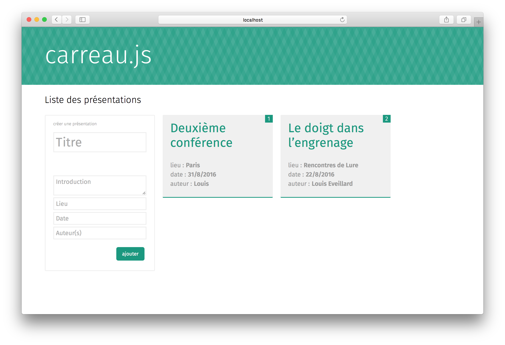

**todo**

A presentation is made from cards that form a stack.

## How it looks / how it works

* creating a new stack, adding cards https://www.youtube.com/watch?v=acjNvDlNPfc

* example of a stack and some live editing of position and size of cards https://www.youtube.com/watch?v=B2OSHOP-zuk

* using iframe to display websites in a stack https://www.youtube.com/watch?v=QfsF0jAgg9U&feature=youtu.be

## How to install

You need node and npm to install the preview of carreau.js

In a terminal : 

1. `git clone --recursive https://github.com/louis-ev/carreau.js path/to/the/folder`
2. `cd path/to/the/folder`
3. `npm install && cd public && bower install`
4. `cd ../`
5. `gulp`

Create a folder named *conferences* next to the *views* and *public* folder.

## To start, experiment and debug

### server-side

* Run `node server.js` to start the server

* Run `node server.js --debug` to start the server with debug in terminal

* Run `node server.js --debug --verbose` to start the server with debug and verbose

To add a npm package, run `npm install` (for example `npm install --save-dev jshint gulp-jshint`).

### client-side

To tweak and write some new SASS or client-side JS, run `gulp` and a gulp task with watch will run.

To add a library, go to the public folder and use bower commands (such as `bower install isotope --save`)
